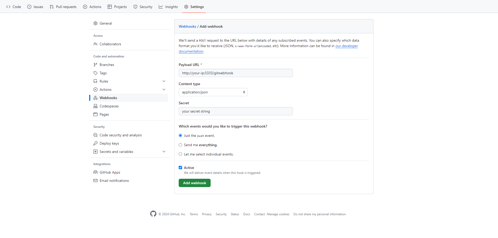

# Auto-Deploy Server for GitHub/Gitea Webhooks
This lightweight Node.js server allows you to automate code deployment from your GitHub or Gitea repositories. When you push changes to your repository, this server will automatically pull the latest code from the branch and execute your custom build scripts.

# Prerequisites
Before setting up the server, ensure you have the following:
1. Node.js: Make sure Node.js is installed on your server.
2. GitHub/Gitea Repository: Your repository should support Git over SSH.
3. SSH Key Pair: Set up SSH keys between your server and the repository.
https://docs.github.com/en/authentication/connecting-to-github-with-ssh/generating-a-new-ssh-key-and-adding-it-to-the-ssh-agent

# Installation

1. Clone/create your project repository into your favorist folder.

2. Clone this repository to your server.
```console
git clone https://github.com/DrMinh/minimum-auto-deploy.git
```

3. Create a `config.json` file in `minimum-auto-deploy` main folder
```json
{
    "port": 3333,
    "path": "/gitwebhook",
    "repositories": [
            {
                    "clone_url": "https://github.com/YourAccount/your-project.git",
                    "local_path": "/path/to/your-project-fodder/",
                    "branch": "dev-build",
                    "ssh_infor": {
                            "ssh_url": "git@github.com:YourAccount/your-project.git",
                            "path_to_private_key": "/path/to/your/private/key"
                    },
                    "script": "script or sh /path/to/your/build/script.sh",
                    "secret": "your secret pass"
            }
    ]
}
```
`ssh_info` is optional. If your Git repository does not support SSH, you do not need to provide it. However, you will need to `cd` into your Git folder and `pull` the updates yourself in the `script`.

4. run the server
```console
node index.js
```
5. Set up git webhook to send request to our server each time repository have new update
https://docs.github.com/en/webhooks/using-webhooks/creating-webhooks



# Warning
The `Minimum Auto Deploy` only uses `git pull` to update your existing project folder. Before using it, you MUST clone your project repository first.